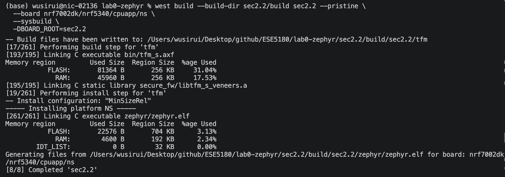
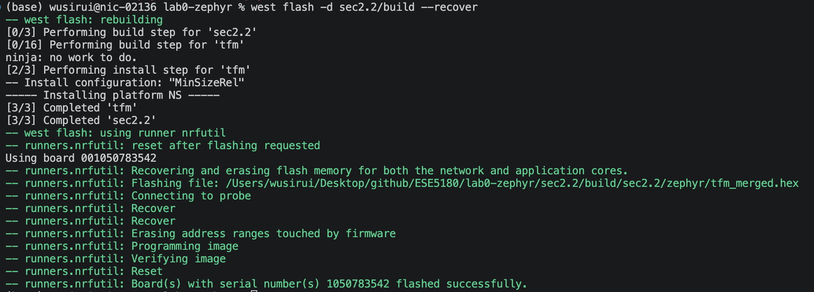
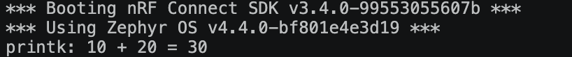
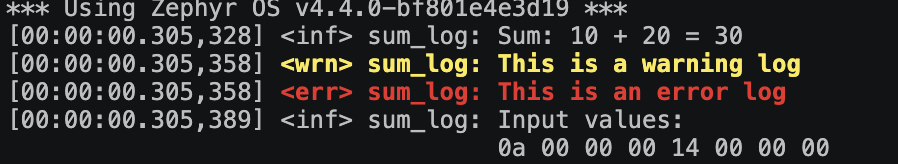
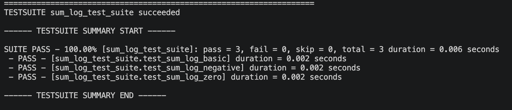
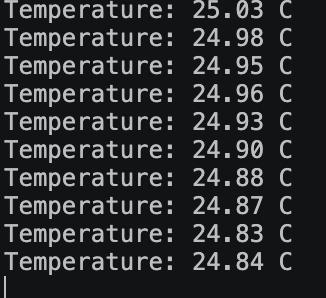
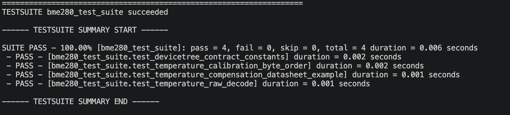

# ESE5180: Lab 0 Zephyr

| Team Member Name | Email Address |
|---|---|
| Sirui Wu | wu40@engineering.upenn.edu |

**GitHub Repository URL:** https://github.com/wu40-cmd/lab0-zephyr

## 1. Hello (Vanilla) Zephyr

## 2. Hello (Nordic) Zephyr

### 2.1 Development environment

### 2.2 Build and flash an example

## 3. Building with west

### 3.1 Command-line build and flash

The application was built and flashed with west 

```sh
west build \
  --build-dir sec2.2/build \
  sec2.2 \
  --pristine \
  --board nrf7002dk/nrf5340/cpuapp/ns \
  --sysbuild

west flash -d sec2.2/build --erase
```





### West command summary

- `west init` creates a west workspace and obtains its manifest, which lists the projects managed by the workspace.
- `west update` clones or updates the projects to the revisions specified by the manifest.
- `west build` configures CMake and invokes the underlying build system, normally Ninja, for a Zephyr application.
- `west flash` invokes the board-specific runner to program the generated firmware image.

### Build and flash arguments

| Argument | Meaning |
|---|---|
| `--build-dir sec2.2/build` | Places generated build artifacts in `sec2.2/build`. |
| `sec2.2` | Positional source-directory argument containing the application. |
| `--pristine` | Deletes stale CMake state before configuring the build. |
| `--board nrf7002dk/nrf5340/cpuapp/ns` | Selects the nRF7002 DK, nRF5340 application core, non-secure target. |
| `--sysbuild` | Builds the multi-image system, including TF-M and the non-secure application. |
| `-d sec2.2/build` | Tells `west flash` which completed build directory to use. |
| `--erase` | Erases flash before programming the merged firmware image. |


## 4. Kconfig

### Think

**What are the logging levels?** Zephyr's standard ordered log levels are `ERR`, `WRN`, `INF`, and `DBG`. A build or runtime filter can discard messages below the selected severity threshold.

**What is the difference between `prj.conf` and `menuconfig`?** `prj.conf` is a version-controlled input fragment that records the application's requested configuration. `menuconfig` is an interactive interface for exploring symbols, dependencies, defaults, and the currently resolved configuration. Changes made only to the generated build `.config` are not durable project configuration and may disappear during a pristine build.

**How and why should the final settings be checked?** After building, inspect `build/sec2.2/zephyr/.config`, or use `west build -t menuconfig`. The generated `.config` contains the resolved result after defaults, dependencies, board settings, and `prj.conf` have been combined. Checking it catches symbols that were ignored or changed because their dependencies were not satisfied.

## 5. Devicetree

### 5.1 LED alias

The board overlay creates the custom `led5180` alias and maps it to `led1`, which is LED2 as labeled on the nRF7002 DK. The application accesses only `DT_ALIAS(led5180)` rather than hard-coding a GPIO controller or pin.

### 5.2 Button polling and LED control

The main loop polls the button with `gpio_pin_get_dt()`. A rising logical edge toggles the LED once, while the previous button state prevents repeated toggles while the button remains held.

### 5.3 Button alias

The overlay creates `button5180 = &button0`, and `main.c` obtains its GPIO specification through `DT_ALIAS(button5180)`. Because the board node includes `GPIO_ACTIVE_LOW`, the GPIO devicetree helpers return a logical pressed/not-pressed value without application code hard-coding the electrical polarity.

**Why use an overlay instead of editing the board DTS?** The board DTS belongs to the SDK and may be shared by many applications or replaced by an SDK update. An application overlay keeps the hardware customization local, reviewable, reproducible, and independent of the installed SDK.

## 6. Printing vs. Logging

The `sum()` function has two implementations selected by a Kconfig choice:

- `CONFIG_SUM_PRINT=y` builds `sum_printk/sum_printk.c` and prints synchronously with `printk()`.
- `CONFIG_SUM_LOG=y` builds `sum_log/sum_log.c`, which produces info, warning, error, and input hexdump messages through Zephyr's logging subsystem.

CMake includes only the selected implementation, so the two definitions of `sum()` cannot conflict.

### 6.1 Output evidence





### 6.2 Video

### Think questions

**`printk()` versus Logger:** `printk()` is small and convenient for early bring-up, but it formats and emits output synchronously and offers little filtering or metadata. The Logger supports severity levels, compile-time and runtime filtering, timestamps, multiple backends, hexdumps, and deferred processing. Those features make it more flexible and reduce the time application code spends waiting for slow console output.

**Why source `Kconfig.zephyr`?** The project Kconfig defines only the application's symbols. `source "Kconfig.zephyr"` brings in Zephyr's top-level Kconfig tree so standard symbols such as logging, GPIO, I2C, console, and kernel options are visible and their dependencies can be resolved.

**Why is deferred logging useful?** A producer quickly places a message into a RAM buffer, then a logging thread formats and transmits it later. This reduces blocking in timing-sensitive threads and interrupt-adjacent paths. The tradeoffs are additional RAM use and the possibility of dropping messages if the buffer fills.

## 7. Ztest for unit testing

The `SUM_UNIT_TEST` application contains three tests covering positive operands, negative operands, and zero. `testcase.yaml` registers the Ztest harness and permits both `qemu_cortex_m3` and the nRF7002 DK target.

```sh
west build -p always -b qemu_cortex_m3 . --no-sysbuild

# Alternatively, from sec2.2:
west twister -T tests/SUM_UNIT_TEST -p qemu_cortex_m3 --inline-logs -v
```

### 7.2 Test evidence



### Think questions

**Where is `main()` in a Ztest application?** The test file does not need to define it. Enabling `CONFIG_ZTEST` links Zephyr's test framework, whose generated/default test entry point initializes the kernel, discovers registered test suites placed into iterable linker sections by the `ZTEST` macros, executes them, and reports their results.

| Topic | `west build` | `west twister` |
|---|---|---|
| Primary purpose | Configure and build one selected application for one board. | Discover, build, run, and aggregate one or many test scenarios. |
| Test discovery | Does not search `testcase.yaml`; the test directory is built explicitly as an application. | Reads `testcase.yaml`, filters scenarios and platforms, and selects harnesses. |
| Scale | Best for rapid local iteration or debugging one test binary. | Best for regression testing across tests, boards, tags, or CI jobs. |
| Results | Build/run output for one image. | Per-scenario statuses, logs, summaries, filtering, and reports. |

## 8. Adding a peripheral: BME280

### 8.1 Hardware integration and temperature output

The overlay enables `i2c1`, maps SCL to P1.14 and SDA to P1.15, and declares `bme280_5180@77` as an `i2c-device`. The application uses `I2C_DT_SPEC_GET()` to obtain the controller and address from devicetree rather than hard-coding a controller device.

The implementation:

1. Confirms that the I2C controller is ready and that register `0xD0` contains BME280 chip ID `0x60`.
2. Reads `dig_T1`, `dig_T2`, and `dig_T3` from calibration registers `0x88` through `0x8D`.
3. Writes `0x21` to `ctrl_meas` (`0xF4`) to request temperature oversampling x1 in forced mode.
4. Polls `status` (`0xF3`) until NVM copying and measurement are complete.
5. Burst-reads `TEMP_MSB` through `TEMP_XLSB` (`0xFA` through `0xFC`) and reconstructs the 20-bit ADC value.
6. Applies the Bosch integer compensation formula and reports temperature with 0.01 degree Celsius resolution.

Observed hardware output was stable at approximately 25 degrees Celsius:

```text
Temperature: 24.66 C
Temperature: 24.64 C
Temperature: 24.60 C
Temperature: 24.60 C
Temperature: 24.59 C
```



### TrustZone/TWIM1 issue

On the nRF5340, UARTE1, TWIM1, and SPIM1 share the SERIAL1 peripheral at `0x40009000`. TF-M initially configured UARTE1 as secure for its own logging, so the non-secure application faulted when the TWIM1 driver accessed the same register block. `CONFIG_TFM_LOG_LEVEL_SILENCE=y` disables TF-M's secure logging and releases SERIAL1 for the non-secure TWIM1 application. This does not disable the application's Zephyr Logger or `printk()` output.

### 8.2 BME280 Ztest

Hardware-independent logic is separated from I2C access so it can run under QEMU. The BME280 test suite checks:

- the required address and BME280 chip ID sanity rules;
- little-endian parsing of `dig_T1`, `dig_T2`, and `dig_T3`;
- reconstruction of the 20-bit raw temperature value; and
- the Bosch datasheet compensation example, which produces approximately 25.08 degrees Celsius.

The real application additionally uses compile-time `BUILD_ASSERT` checks to require the BME280 devicetree node, `okay` status, and address `0x77`.

```sh
cd sec2.2/tests/BME280_UNIT_TEST
west build -p always -b qemu_cortex_m3 . --no-sysbuild
west build -t run
```

The suite completed successfully with four passing tests and no failures:

```text
SUITE PASS - 100.00% [bme280_test_suite]: pass = 4, fail = 0, skip = 0, total = 4
PROJECT EXECUTION SUCCESSFUL
```



## 9. Teaching Team Checkoff

